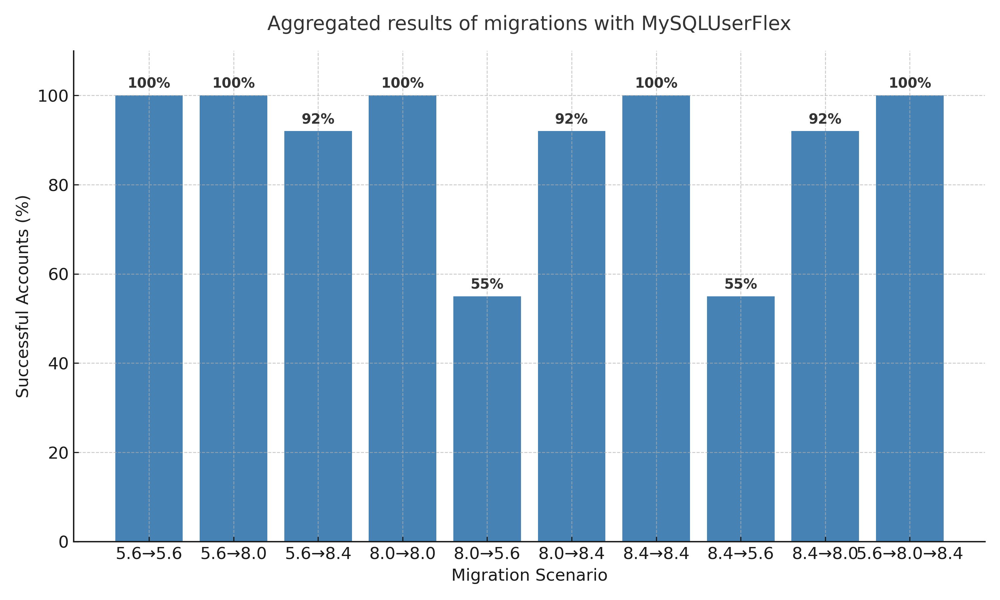
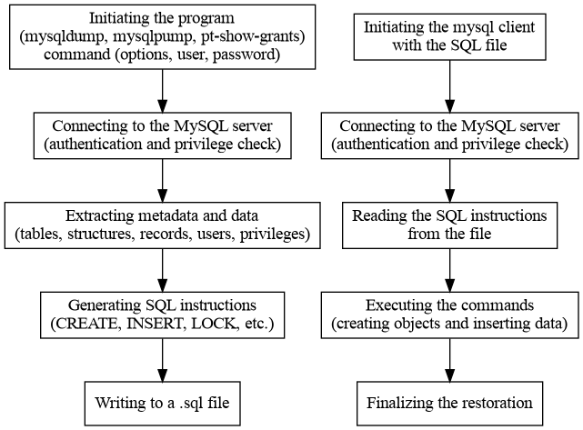
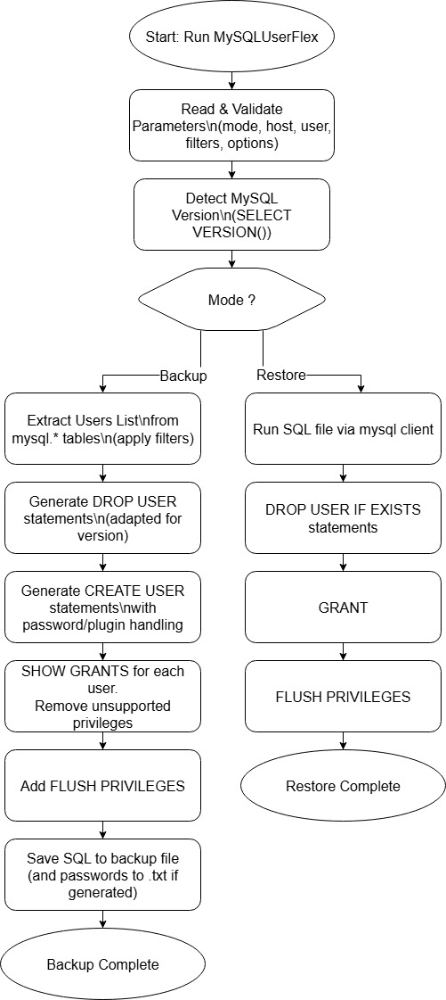
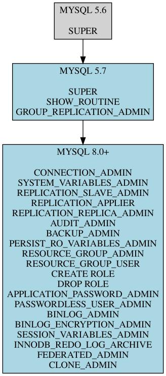

# MySQLUserFlex

**MySQLUserFlex** is a Bash-based tool for backing up and restoring MySQL user accounts and privileges across multiple versions of MySQL (5.6, 5.7, 8.0+).  
It is designed to handle cross-version migrations, filtering out unsupported privileges and adapting SQL syntax automatically, ensuring safe and reliable restoration.

---

## ✨ Features

- ✅ Supports MySQL 5.6, 5.7, and 8.0+
- ✅ Cross-version backups (e.g. from 8.0 → 5.6)
- ✅ Skips system accounts by default (optional include)
- ✅ Uses `SHOW GRANTS` for safe privilege extraction
- ✅ Automatically adapts `CREATE USER` and `GRANT` syntax
- ✅ Optional strong password generation (`--generate-passwords`)
- ✅ Safe `DROP USER` handling for older versions without `IF EXISTS`

---

## ⚙️ Installation

Clone the repository and make the script executable:

```bash
git clone https://github.com/yourusername/mysqluserflex.git
cd mysqluserflex
chmod +x mysqluserflex.sh
```

---

## 📖 Usage

MySQLUserFlex allows you to back up and restore MySQL users across versions (5.6, 5.7, 8.0+).  
By default, system accounts are skipped unless explicitly included.

---

## 💾 Backup Examples

**Backup from MySQL 8.0 to MySQL 8.0 (default):**
```bash
./mysqluserflex.sh -m backup -h localhost -u root -f users.sql
```

**Backup from MySQL 8.0 to MySQL 5.6:**
```bash
./mysqluserflex.sh -m backup -h localhost -u root -f users_56.sql --target-version 5.6
```

**Backup from MySQL 8.0 to MySQL 5.7:**
```bash
./mysqluserflex.sh -m backup -h localhost -u root -f users_57.sql --target-version 5.7
```

---

## 🔄 Restore Example

**Restore users from an existing backup:**
```bash
./mysqluserflex.sh -m restore -h localhost -u root -f users_56.sql
```

---

## 📌 Arguments

| Argument                       | Description                                                     |
|--------------------------------|-----------------------------------------------------------------|
| `-m`                           | backup or restore                                               |
| `-h`                           | MySQL host (default: localhost)                                 |
| `-u`                           | MySQL user                                                      |
| `-p`                           | MySQL password (if not provided, requested interactively)       |
| `-P`                           | MySQL port (default: 3306)                                      |
| `-f`                           | Backup/restore file                                             |
| `--target-version`             | Target MySQL version for backup (default: current version)      |
| `--include-system-users`       | Includes system accounts in backup (skipped by default)         |
| `--downgrade-passwords legacy` | Converts 8.0+ passwords to SHA1 (requires prior `ALTER USER`)   |
| `--force-convert-plugin`       | Force conversion to `mysql_native_password` (useful for 5.6)    |
| `--socket`                     | Path to MySQL socket file (e.g., `/var/run/mysqld/mysqld.sock`) |
| `--user=username`              | Backup only a specific user                                     |
| `--generate-passwords`         | Generates new random passwords for MySQL users                  |

---

## 📝 Example Output

When backing up a user from MySQL 8.0, MySQLUserFlex generates a compatible SQL script:

```sql
DROP USER IF EXISTS 'testuser'@'localhost';
CREATE USER 'testuser'@'localhost' IDENTIFIED WITH 'mysql_native_password' AS '*94BDCEBE19083CE2A1F959FD02F964C7AF4CFC29';
GRANT SELECT, INSERT ON `mydb`.* TO 'testuser'@'localhost';
FLUSH PRIVILEGES;
```

If `--generate-passwords` is enabled, an additional `.txt` file will contain random passwords:

```
testuser@localhost -> A8f!p9xzr2MKd
```

---

## 🧪 Example SQL Test File

You can generate test users with:

```sql
CREATE USER 'readonly_user'@'%' IDENTIFIED BY 'readonly123';
GRANT SELECT ON *.* TO 'readonly_user'@'%';

CREATE USER 'readwrite_user'@'localhost' IDENTIFIED BY 'rwpass123';
GRANT SELECT, INSERT, UPDATE, DELETE ON testdb.* TO 'readwrite_user'@'localhost';
```

---

## 📊 Results & Diagrams

### Migration Results


### Backup & Restore Process


### MySQLUserFlex Workflow


### Privilege Changes Between Versions


---

## 📋 Tables

### Table 1. Comparative overview of existing methods and MySQLUserFlex

| Criterion             | mysqldump | mysqlpump | pt-show-grants | MySQLUserFlex |
|-----------------------|-----------|-----------|----------------|---------------|
| Version compatibility | No        | No        | Partial        | Yes           |
| Privilege filtering   | No        | No        | No             | Yes           |
| Intelligent formatting| No        | No        | Partial        | Yes           |
| Safe extraction       | Yes       | Yes       | Yes            | Yes           |
| Migration readiness   | No        | No        | Partial        | Yes           |

---

### Table 2. Key Differences in Privileges

| Privilege                   | 5.6 | 5.7 | 8.0+ | Notes                                                                 |
|-----------------------------|-----|-----|------|----------------------------------------------------------------------|
| SUPER                       | ✅  | ✅  | ❌   | Split into more specific privileges in 8.0 (e.g., `CONNECTION_ADMIN`, `SYSTEM_VARIABLES_ADMIN`) |
| CONNECTION_ADMIN            | ❌  | ❌  | ✅   | New in 8.0, partially replaces `SUPER`                               |
| SYSTEM_VARIABLES_ADMIN      | ❌  | ❌  | ✅   | New in 8.0, allows modification of global system variables           |
| REPLICATION_SLAVE_ADMIN     | ✅  | ✅  | ❌   | In 8.0, enables control over replication slave threads               |
| REPLICATION_APPLIER         | ❌  | ❌  | ✅   | New in 8.0, related to applying replication data                     |
| REPLICATION_REPLICA_ADMIN   | ❌  | ❌  | ✅   | Introduced in 8.0.22, related to replication                         |
| AUDIT_ADMIN                 | ❌  | ❌  | ✅   | New in 8.0, manages *MySQL Enterprise Audit*                         |
| BACKUP_ADMIN                | ❌  | ❌  | ✅   | New in 8.0.21, rights for backup and restore using `CLONE` and others|
| PERSIST_RO_VARIABLES_ADMIN  | ❌  | ❌  | ✅   | New in 8.0.27, modification of read-only variables                   |
| RESOURCE_GROUP_ADMIN        | ❌  | ❌  | ✅   | New in 8.0.3, allows creation/management of resource groups          |
| RESOURCE_GROUP_USER         | ❌  | ❌  | ✅   | New in 8.0.3, allows assigning threads to resource groups            |
| CREATE ROLE                 | ❌  | ❌  | ✅   | Roles introduced in 8.0                                              |
| DROP ROLE                   | ❌  | ❌  | ✅   | Also part of role management                                         |
| APPLICATION_PASSWORD_ADMIN  | ❌  | ❌  | ✅   | Introduced in 8.0.14 for temporary passwords                         |
| PASSWORDLESS_USER_ADMIN     | ❌  | ❌  | ✅   | New in 8.0.30, allows passwordless users                             |
| BINLOG_ADMIN                | ❌  | ❌  | ✅   | New in 8.0.14, binary log administration                             |
| BINLOG_ENCRYPTION_ADMIN     | ❌  | ❌  | ✅   | New in 8.0.14, manages binlog encryption                             |
| SHOW_ROUTINE                | ✅  | ✅  | ❌   | Removed in 5.7; related to viewing stored procedures and functions   |
| GROUP_REPLICATION_ADMIN     | ❌  | ✅  | ✅   | Appeared in 5.7.6, group replication management                      |
| SESSION_VARIABLES_ADMIN     | ❌  | ❌  | ✅   | New in 8.0.14, allows modification of session variables              |
| INNODB_REDO_LOG_ARCHIVE     | ❌  | ❌  | ✅   | Introduced in 8.0.21, redo log archiving                             |
| FEDERATED_ADMIN             | ❌  | ❌  | ✅   | New in 8.0.27, administration of FEDERATED tables                    |
| CLONE_ADMIN                 | ❌  | ❌  | ✅   | New in 8.0.17, enables cloning of instances                          |

**Legend:**  
✅ Privilege exists in this version  
❌ Privilege not supported in this version

---

### Table 3. MySQL commands used in MySQLUserFlex

| Command | Description | Role in MySQLUserFlex |
|---------|-------------|-----------------------|
| SHOW GRANTS | Displays all privileges associated with a given user. | Extracts current rights and adapts them for migration. |
| SELECT … FROM mysql.user (and system tables) | Reads info from system tables (`mysql.user`, `mysql.db`, etc.). | Provides details for password hashes, SSL parameters, and adapts to schema changes. |
| CREATE USER | Creates a new account. | Recreates identical accounts in the target DB. |
| GRANT | Assigns privileges. | Restores original rights, adapted for target version. |
| ALTER USER | Modifies parameters of existing accounts. | Safer than recreating users in some migrations. |
| DROP USER | Deletes existing accounts. | Ensures no duplicates during restore. |
| FLUSH PRIVILEGES | Reloads privilege tables. | Ensures changes are applied immediately. |

---

### Table 4. Core Functions of MySQLUserFlex

| Function | Description | Role in MySQLUserFlex |
|----------|-------------|------------------------|
| `usage()` | Displays help/syntax and options | Invoked when params missing or invalid |
| `build_mysql_command()` | Builds MySQL CLI command | Centralizes mysql calls, avoids duplication |
| `is_system_user()` | Checks if account is system | Skips default accounts unless included |
| `detect_mysql_version()` | Detects server version | Sets compatibility (5.6 / 5.7 / 8.0+) |
| `filter_grants_for_target_version()` | Normalizes GRANT output | Removes unsupported privileges |
| `generate_safe_drop_user()` | Generates safe DROP USER | Ensures compatibility with older MySQL |
| `generate_strong_password()` | Creates random strong passwords | Enables controlled password rotation |
| `user_exists()` | Verifies account presence | Auxiliary check for diagnostics |
| `is_valid_sha1_hash()` | Validates legacy SHA1 | Ensures fallback for MySQL 5.6 passwords |

---

### Table 5. Results

| User                   | 5.6→5.6 | 5.6→8.0 | 5.6→8.4 | 8.0→8.0 | 8.0→5.6 | 8.0→8.4 | 8.4→8.4 | 8.4→5.6 | 8.4→8.0 | 5.6→8.0→8.4 | Notes |
|------------------------|---------|---------|---------|---------|---------|---------|---------|---------|---------|--------------|-------|
| readonly_user@%        | ✅       | ✅       | ✅       | ✅       | ✅       | ✅       | ✅       | ✅       | ✅       | ✅            | - |
| readwrite_user@localhost | ✅     | ✅       | ✅       | ✅       | ✅       | ✅       | ✅       | ✅       | ✅       | ✅            | - |
| app_user@%             | ✅       | ✅       | ⚠       | ✅       | ✅       | ⚠       | ✅       | ✅       | ✅       | ✅            | Downgrade: missing `REFERENCES` |
| db_admin@localhost     | ✅       | ✅       | ✅       | ✅       | ⚠       | ✅       | ✅       | ⚠       | ✅       | ✅            | `GRANT OPTION` exists in 5.6 but no role management |
| sha2_cache_user@%      | ❌       | ✅       | ✅       | ✅       | ❌       | ✅       | ✅       | ❌       | ✅       | ✅            | 5.6 does not support `caching_sha2_password` |
| native_user@localhost  | ✅       | ⚠       | ✅       | ✅       | ✅       | ⚠       | ✅       | ⚠       | ✅       | ⚠            | In 8.4 `mysql_native_password` is disabled by default |
| sha256_user@localhost  | ✅       | ✅       | ✅       | ✅       | ✅       | ⚠       | ✅       | ✅       | ✅       | ✅            | In 5.6 replaced with `mysql_native_password` |
| testuser@localhost     | ✅       | ✅       | ✅       | ✅       | ❌       | ✅       | ✅       | ❌       | ✅       | ✅            | `auth_socket` not supported in 5.6 |
| expired_user@localhost | ✅       | ✅       | ✅       | ✅       | ✅       | ⚠       | ✅       | ⚠       | ✅       | ✅            | 5.6 does not support `PASSWORD EXPIRE` |
| expiring_soon@localhost| ✅       | ✅       | ✅       | ✅       | ✅       | ⚠       | ✅       | ⚠       | ✅       | ✅            | Password lifetime policies missing in 5.6 |
| locked_user@%          | ✅       | ✅       | ✅       | ✅       | ✅       | ✅       | ✅       | ⚠       | ✅       | ✅            | `LOCK/UNLOCK` not supported in 5.6 |
| policy_user@localhost  | ✅       | ✅       | ✅       | ✅       | ✅       | ⚠       | ✅       | ⚠       | ✅       | ✅            | Password policies not supported in 5.6 |

This table provides a detailed overview of the compatibility of individual users and migration scenarios.  
Cells:
**Legend:** 
- ✅ indicate full recovery,  
- ⚠ indicate partial recovery with ignored or transformed rights,  
- ❌ indicate inability to restore due to incompatible plugins or syntax.  

---

## 📜 License

This project is licensed under the MIT License – see the [LICENSE](LICENSE) file for details.
